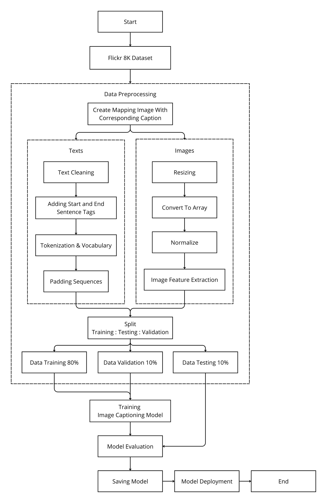
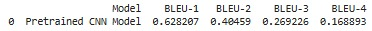

# 🖼️ Image Captioning App

## 📌 Project Overview

Image Captioning App is a deep learning-based web application that generates descriptive text for images. This application allows users to upload an image or enter an image URL, and it will generate a meaningful description using a pretrained **CNN (EfficientNetV2S)** as a feature extractor and **LSTM** for text generation.

## 🔥 Features

✅ Upload an image or provide an image URL

✅ Automatic image description generation

✅ Displays the uploaded image alongside its generated description

✅ Built with **Streamlit** for an interactive and user-friendly interface

✅ Trained on the **Flickr8K dataset**

## 🏗️ Project Architecture

The application follows a **two-stage processing pipeline**:

1️⃣ **Feature Extraction (CNN)** → Extracts meaningful visual features from the image using a pretrained **EfficientNetV2S** model.

2️⃣ **Sequence Generation (LSTM)** → Uses extracted image features and generates a descriptive caption using an **LSTM-based** decoder.

### 🔹 Flowchart Diagram



## 🎯 Model Performance

The model was evaluated using **BLEU Score**, which measures the similarity between generated and reference captions.

### 🔢 BLEU-n Gram Score Formula

The BLEU score for n-grams is computed as follows:

$$
BLEU = BP \cdot \exp \left( \sum_{n=1}^{N} w_n \log p_n \right)
$$

Where:

- $BP$ is the brevity penalty,
- $w_n$ is the weight for each n-gram,
- $p_n$ is the precision for n-gram matching.

### 📊 BLEU Score Results



| Metric | Score |
| ------ | ----- |
| BLEU-1 | 0.628 |
| BLEU-2 | 0.404 |
| BLEU-3 | 0.269 |
| BLEU-4 | 0.168 |

## 🚀 How to Use

1️⃣ **Install Dependencies**

```bash
pip install -r requirements.txt
```

2️⃣ **Run the Streamlit App**

```bash
streamlit run img-capt-app.py
```

3️⃣ **Upload an image or provide an image URL**

4️⃣ **Click "Generate Description"** to get the image caption.

## 🖼️ App Preview

Take a look at how the **Image Captioning App** works below! 👇

🔗 **Live Demo:** [Try the App Here](https://image-captioning-cnn-lstm-ruplwhs8vwyoxpwlarbl5r.streamlit.app/)


